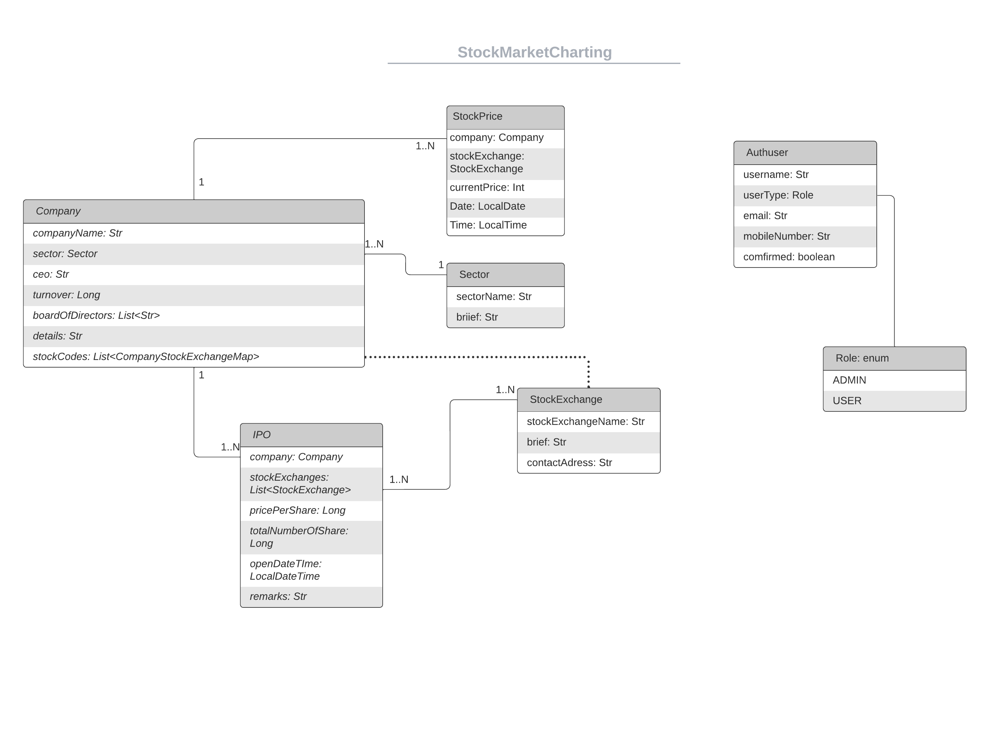

# [StockMarketCharting](https://stockmarketcharting-angular.herokuapp.com/)

Backend Deployed @ https://shrouded-waters-11504.herokuapp.com/
Frontend Deployed @ https://stockmarketcharting-angular.herokuapp.com/

### Technologies Used:
* [Spring-Boot](https://spring.io/projects/spring-boot) : an open source Java-based framework used to create a micro Service.
* [Angular](https://angular.io/) : a TypeScript-based free and open-source web application framework led by the Angular Team at Google and by a community of individuals and corporations. 
* [PostgreSQL](https://www.postgresql.org/) : free and open-source relational database management system emphasizing extensibility and SQL compliance.

### ER Diagram:

### Key Features:
- JWT based Authentication
- Role-based Authorization
- CRUD operations
- Charts and Comparision 
- Suggestive Search

### Role-based Functions:
- ADMIN: 
  * Import Data
  * Add/List IPOs
  * Add/List Companies
  * Add/List Stock Exchanges

- USER: 
  * Signup/Login/Logout
  * List IPOs
  * Compare Companies/Sectors
  * View Profile
